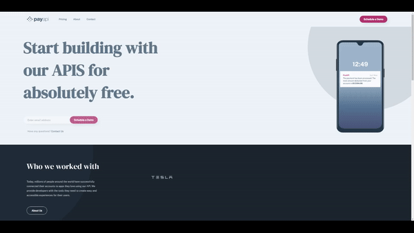

## Payapi


Frontend mentor 4-page website challenge. Marketing site with custom form validation, layouts
for mobile, tablet&desktop.

- [Demo vercel](https://pay-api-website-iota.vercel.app/)
- [Frontendmentor](https://pay-api-website-iota.vercel.app/)

## Build with

- [React](https://reactjs.org/docs/create-a-new-react-app.html)
- [Next.js](https://nextjs.org/learn)
- [Framermotion](https://www.framer.com/motion/)
- [SCSS](https://nextjs.org/learn)

## Installation guide

Installation:

```bash
# select folder
$ cd front-dev-case
# install dependencies
$ npm install
#  development server
$ npm run dev
```

Usage:

```bash
# development server
$ npm run dev
# build server
$ npm run build
```

Open [http://localhost:3000](http://localhost:3000) with your browser to see the result.
